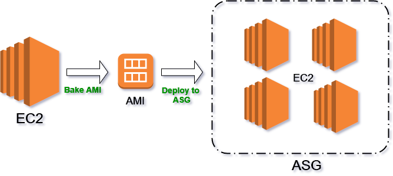
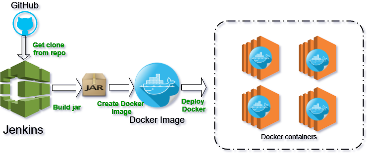
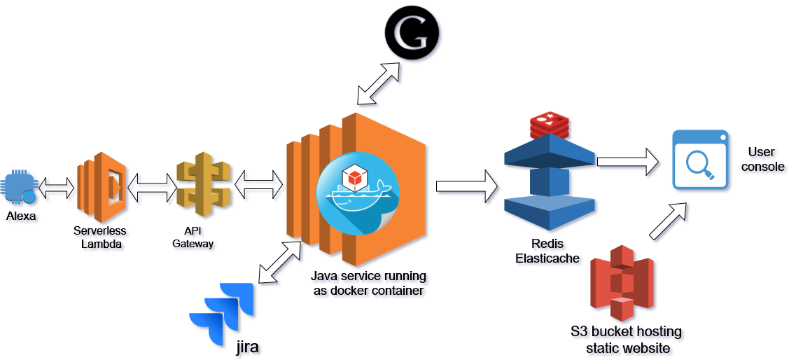

# HackNC-infra-as-code
This contains all code and configuration details to maintain instances on AWS. This is for HackNC 2017 hackathon.

# AWS as infrastructure
* Our entire infrastructure is hosted on AWS. Right from baking AMI to create VM, running build tools such as Jenkins on EC2 server, creating Auto scaling group to deploy our production servers, triggering AWS Serverless Lambda function from Alexa voice service and Hosting static site on S3 bucket.
* The User monitoring console hosted as static website on S3 bucket which can be accessed on the web through this link - UI/Portal
* Hosting on AWS provides a lot of flexibility in terms of creating security policies and implementing it. We have extensively used AWS IAM policy to create IAM roles for services to consume other services smoothly within private VPC, there by securing our infrastructure.

#### Fig 1. Creating AMI from existing instance, this was done manually but in reality should be automated as well
  

#### Fig 2. Deployment technique used which shows jar file is deployed into Docker containers
  

#### Fig 3. Complete Emma infrastructure service

#### DevOps tools used include
`AWS` as public cloud, `Jenkins` as build tool, `Ansible` to assist in deploy task, `Docker` to run Java service as container, `Serverless Lambda` to route `Alexa` intent, `API Gateway` to expose API endpoints to Lambda function, `Elasticache (redis)` as in memory DB store, `S3` bucket to host the static site.  

# Story
## Inspiration
Any software that is developed revolves around simplifying the task of humans. In regard to this there are many tools which try to simplify the task for people who develop software. We know how widespread is the Agile methodology in software industry and our Emma Bot aims to simplify an important part of their day-to-day tasks. Stand up meetings require physical effort by all the team members and simplifying human-computer interaction. Even for these short meetings, developers end up putting some effort. Our aim is to reduce it and eliminate the need of the developer to carefully look at and interact with the Scrum Board(computer).

## What it does
Emma Bot is accessed by using Amazon's Alexa. Within a stand-up meeting Emma can act as a Scrum master. Some of the functionalities it can perform are manage an issue, modify the scope of the sprint, give out the summary of the on-going sprint etc. Now instead of giving daily stand-up updates and a person acting as Scrum master manually updating issues Emma can automate the task of giving stand-up and modifying the scrum board.

## How I built it
The Emma Bot's user interface is via Alexa enabled device. Atlassian Jira is used as task tracking scrum board. Alexa is integrated with AWS Serverless lambda function which consumes RESTful endpoints exposed by our core scrum java service. This core scrum service is deployed as Docker containers in AWS. Google API is used for accessing calendar events and schedule meeting. The complete infrastructure is hosted on AWS, built as a CI/CD pipeline. We have used Jenkins build management tool to build and deploy our services.

## Challenges we ran into
1) Training Alexa to understand user's instructions as it can misinterpret voice input many times.
2) Given the demand to build the Alexa service in a short span, we needed a way to quickly deploy every change and test it quickly. We addressed this by building a CI/CD pipeline to build & deploy our service after every feature was added.
3) Finding a suitable time to schedule a meeting when all the attendees are available was a challenge on its own.
4) We created a portal to see the actions performed by Emma. We initially though of storing all the logs into AWS Aurora RDS instance but it had performance issues. We tackled this by using in-memory cache DB Redis as an Elasticache service of AWS.

## Accomplishments that we're proud of
1) Perform daily stand-up meeting task just by giving voice input thereby automating task movements and witness changes on the JIRA Scrum Board.
2) Reducing each team member's effort and time put in, thereby eliminating need of a physical Scrum Master.
3) Building CI/CD pipeline to make deploying step simpler and making development process smoother. With that demonstrating that using DevOps can help you reduce time to market. (This is the DevOps guy -> http://suniltheta.com, Hire him!)

## What we learnt
* Writing Alexa skills and training it for customized events.
* Automating actions on two different platforms (google calendar and JIRA board) by providing just voice input.

## What's next for Emma Bot as Scrum Master
* Implementing more functionalities like notes/comment taking from user for his/her tasks.
* Creating sprints/issues although this would require more user input and larger voice inputs will tend to have more errors.
* Make it a cross-platform bot service , example any other Scrum Boards like GitHub task tracker & Trello could be used.
